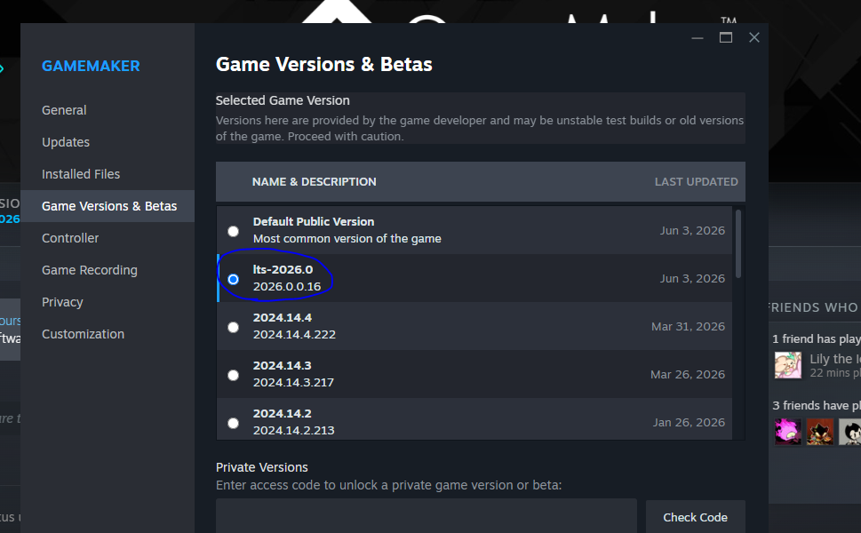

# Pizza Tower - Cobble Framework

### !! IF YOU CANNOT PROGRAM IN GML, AND OR USE GMS2, I CANNOT RECCOMEND THIS TO YOU !!

If you are looking to create a very basic level, with basic sprite changes and base game objects, please use [Create Your Own Pizza](https://gamebanana.com/mods/443629) by srPerez, your needs are better fulfilled there.

BUT, if you are creating a fangame, advanced custom levels with custom objects and gimmicks, or anything along the lines of those two I CAN recommend Cobble-Framework to you!

What I'm trying to say is this framework will not hold your hand, if you aren't okay with that use something else.

---

Have you ever tried creating something with a Pizza Tower decomp? Ever got tied up in the base games spaghetti code? Ever got frustrated with how much unused fluff and filler populate the games files?

Well, Cobble-Framework is the thing just for you!

Cobble-Framework is a open source rewrite of Pizza Tower built to be a starting point for your fan creation needs, no more speghetti, no fluff and filler, no more fighting against the base games horrible and unorganized codebase.

All art assets, and characters from Pizza Tower belong entirely to Tour de Pizza. No copyright infringement is intended.

# Dependencies
- [GameMaker LTS 2026](https://gamemaker.io/en/blog/lts-2026-release)

